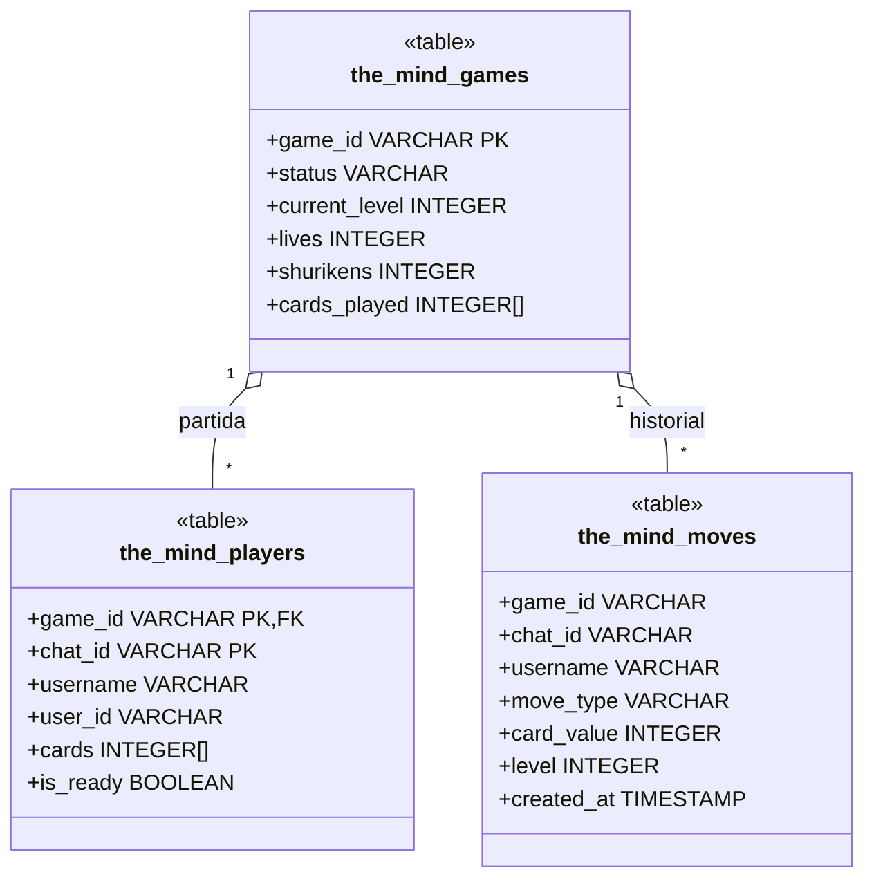
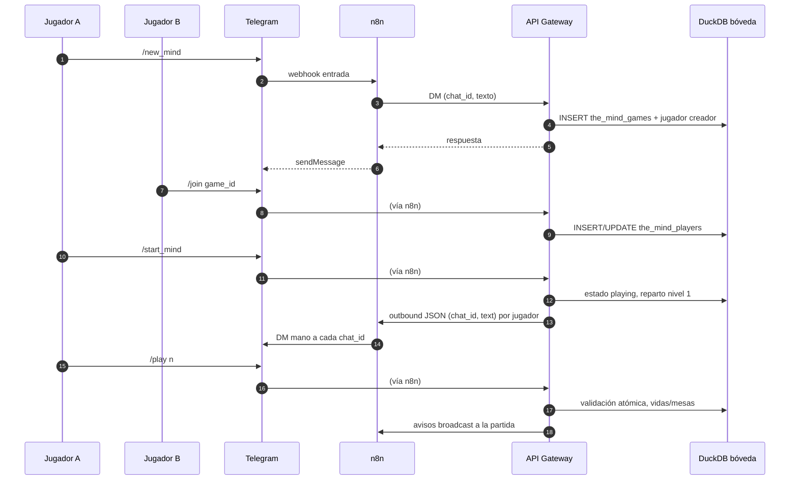

# Cómo jugar The Mind con DuckClaw

Guía para jugar **The Mind** usando el crupier virtual **TheMindCrupier** y los **fly commands** del API Gateway (estado en la bóveda DuckDB activa de cada usuario).

---

## 1. Qué es The Mind

The Mind es un juego de cartas cooperativo. Los jugadores tienen cartas numeradas (1–100) y deben jugarlas **en orden ascendente** sin poder hablar de los números. Si alguien juega una carta y otro tenía una menor sin jugarla, pierden una vida. El objetivo es superar los niveles sin quedarse sin vidas.

---

## 2. Configuración

1. **Añadir el crupier al equipo del chat**  
   ```
   /workers --add TheMindCrupier
   ```
   (También vale `themindcrupier` en minúsculas.)

2. **Plantilla de referencia**  
   Copia en repo: [`templates/workers/the_mind_crupier/`](../templates/workers/the_mind_crupier/README.md) (canónico en `packages/agents/.../TheMindCrupier/`).

3. **Requisitos**  
   - Webhook n8n (u otro bridge) para enviar **DM** con `chat_id` + `text` (ver abajo).  
   - Cada jugador debe hacer **`/join`** desde el **DM** del bot para que su `chat_id` privado quede en `the_mind_players`.

### Equipo `/team` y mensajes

- Si el tenant tiene usuarios en **`/team`**, solo esos `user_id` pueden **crear** partidas (`/new_mind`), **unirse** (`/join`) e **iniciar** (`/start_mind`). Si la lista está vacía, no se aplica esta restricción (compatibilidad).
- **Cartas:** cada jugador recibe un **mensaje distinto** por DM (mano propia).
- **Avisos del juego** (nivel, errores, victoria): el **mismo texto** se envía en paralelo al **DM de cada jugador** de la partida (no hay chat grupal obligatorio en el motor).
- Tras **`/new_mind`**, el bot añade un recordatorio con el listado actual de `/team` y los pasos para invitar e iniciar.

---

## 3. Variables de entorno (outbound / n8n)

El motor usa **la primera URL definida** entre (en orden; alineado con `send_proactive_message` / homeostasis):

| Variable | Uso |
|----------|-----|
| `N8N_OUTBOUND_WEBHOOK_URL` | Mismo webhook n8n que mensajes proactivos y el resto de salidas |
| `DUCKCLAW_TELEGRAM_SEND_WEBHOOK_URL` | Override opcional solo para Telegram |
| `DUCKCLAW_SEND_DM_WEBHOOK_URL` | Override opcional solo para DM |

**Payload JSON:** `{"chat_id": "<id>", "user_id": "<id>", "text": "<mensaje>"}`  
(`user_id` repite el mismo valor que `chat_id` para flujos n8n que solo lean `user_id`.)

**Autenticación opcional:**

- `N8N_AUTH_KEY` → cabeceras `X-N8N-Auth` y `X-DuckClaw-Secret` (mismo valor, por compatibilidad con distintos nodos HTTP).
- `DUCKCLAW_WEBHOOK_SECRET` → solo `X-DuckClaw-Secret` (si está definido, tiene prioridad sobre el duplicado desde `N8N_AUTH_KEY`).

---

### Si no llegan los DMs

1. **Variables en el proceso del gateway (p. ej. PM2 `TheMind-Gateway`):** debe existir `N8N_OUTBOUND_WEBHOOK_URL` (recomendado, igual que mensajes proactivos) u otra URL de la tabla. Si ninguna está definida, `/start_mind` guarda las cartas en DuckDB pero el resumen dirá `skipped_no_url`.
2. **n8n:** el workflow de entrada (Telegram → gateway) no sustituye el webhook de **salida**. Necesitas un flujo que reciba el POST del gateway y llame a Telegram `sendMessage` con el `chat_id` del JSON.
3. **Ejecuciones fallidas:** revisa logs del gateway (`duckclaw.the_mind_outbound`): errores HTTP o timeouts aparecen como warning. En n8n, revisa el webhook de salida (código 401/404).
4. **Mínimo 2 jugadores:** `/start_mind` exige dos filas en `the_mind_players` salvo que definas `DUCKCLAW_THE_MIND_ALLOW_SOLO=true`.

---

## 4. Comandos del juego (fly — sin LLM)

El estado vive en DuckDB (`the_mind_games`, `the_mind_players`) en la **bóveda activa** del usuario que invoca el comando.

| Comando | Descripción |
|---------|-------------|
| **`/new_mind`** | Crea partida (alias de `/new_game the_mind`). El creador queda registrado como jugador. |
| **`/new_game the_mind`** | Igual que arriba. |
| **`/join <game_id>`** | Unirse desde el DM del bot. |
| **`/start_mind [game_id]`** | Pone la partida en `playing`, reparte **Nivel 1** (1 carta por jugador), envía cartas por DM y anuncia el inicio a todos. La respuesta resume cuántos DMs fueron OK o fallidos. |
| **`/game`** | Lista partidas en `waiting` o `playing` con jugadores, nivel y vidas (alias: `/games`, `/mind_games`). |
| **`/play <n>`** | Jugar carta `n` (1–100). Validación atómica; error = −1 vida y limpieza de cartas menores. |
| **`/deal [game_id]`** | Reparte de nuevo según `current_level` (p. ej. tras subir de nivel). |
| **`/start_game [game_id]`** | Solo pasa a `playing` sin repartir (compatibilidad). |

El esquema de tablas se crea con **`_ensure_the_mind_schema`** al crear/unirse/jugar; no hace falta un comando solo para DDL.

---

## Diagrama UML (Mermaid)

Los bloques siguientes usan [Mermaid](https://mermaid.js.org/): en GitHub, GitLab, VS Code (extensión Markdown) y Cursor se **renderizan como diagramas** (SVG) sin archivo PNG aparte.

### Modelo de datos (tablas DuckDB)



### Secuencia: crear partida, unirse, iniciar y jugar carta



---

## 5. Flujo recomendado (2 jugadores)

1. Ambos usuarios deben estar en **`/team`** del tenant (Telegram Guard).
2. **Usuario A:** `/new_mind` → copia el `game_id`.
3. **Usuario B:** en su DM con el bot, `/join <game_id>`.
4. **Usuario A (u organizador):** `/start_mind` o `/start_mind <game_id>`.
5. Cada uno recibe sus cartas por **DM** (webhook). Mensaje público de progreso vía broadcast a todos los `chat_id` de la partida.
6. Por turnos, en DM: `/play <n>` hasta vaciar el nivel. El motor avanza de nivel o marca victoria al completar el nivel 12.

---

## 6. Verificación en DuckDB (bóveda del usuario)

Sustituye la ruta por la de tu bóveda activa (`db/private/<user_id>/...finanzdb1.duckdb` o la que muestre `/vault`):

```sql
SELECT * FROM the_mind_games WHERE game_id = 'game_...';
SELECT game_id, chat_id, username, cards, is_ready FROM the_mind_players WHERE game_id = 'game_...';
```

Tras Nivel 1 con 2 jugadores y jugadas correctas: manos vacías, `cards_played` con las cartas en orden, y mensaje de paso a Nivel 2 (o victoria si estabas en nivel 12).

---

## 7. Reglas que aplica el motor

- **Orden:** Si alguien juega `num` y otro jugador tenía una carta `&lt; num`, pierden 1 vida y se eliminan de **todas** las manos las cartas `&lt; num`.
- **Cartas en secreto:** Solo por DM; el broadcast no revela manos.
- **Niveles:** Tras vaciar todas las manos, se limpia `cards_played` y se reparte el siguiente nivel (`current_level` cartas por jugador). Tras completar el nivel 12, estado `won`.

---

## 8. Resumen rápido

```
/workers --add TheMindCrupier
/new_mind
/join <game_id>          # cada jugador, por DM
/game                    # opcional: ver partidas activas
/start_mind [game_id]
/play 15                  # en tu DM
```

---

## 9. ¿Como Jugarlo?

1. Todos los jugadores reciben cartas numeradas (según el nivel).

2. Objetivo: jugar todas las cartas en orden ascendente sin hablar ni hacer señales.

3. En cualquier momento, un jugador puede poner su carta si cree que es la siguiente más baja.

4. Si alguien se equivoca (por ejemplo, tenía una carta menor), se pierden vidas.

5. El juego avanza por niveles, con más cartas cada vez.
A veces hay habilidades especiales (como ver cartas o descartar).

---

## 10. Habilidad especial 

- ⭐ Shuriken 

- Para qué sirve: ayudar al grupo cuando está atascado.

- Cualquier jugador puede proponer usarlo escirbiendo el comando 
`/shuriken`

- si todos los jugadores aceptan (escribiendo el mismo comando) automaticamente se descarta su carta mas baja, como si ya la hubieran jugado.

- Es muy útil cuando se tiene la sospecha que alguien tiene una carta muy baja y nadie se atreve a jugar.

---

## 11. Guardado de las partidas

- Todo se guarda en una base de datos local (llamada DuckDB) que está dentro de tu carpeta personal en el servidor. Esto significa que si el bot se apaga o se reinicia, la partida no se pierde; puedes continuar exactamente donde te quedaste.

- ¿Qué información guarda?

- El bot lleva dos "listas" internas para cada partida:

- La Lista de la Partida: Aquí anota en qué nivel esta(del 1 al 12), cuántas vidas quedan y qué cartas ya se han puesto sobre la mesa.

---

## Diagrama UML

```mermaid
classDiagram
    direction TB

    class TheMindCrupier {
        <<Worker/Agent>>
        +String worker_id
        +_ensure_the_mind_schema()
        +handle_command(command)
        +broadcast_status(game_id)
        +send_dm(chat_id, text)
    }

    class Game {
        <<DuckDB: the_mind_games>>
        +String game_id
        +String tenant_id
        +Int current_level
        +Int lives
        +Int shurikens
        +String status
        +List~Int~ cards_played
        +DateTime created_at
        +new_mind()
        +start_game()
        +next_level()
        +check_victory()
    }

    class Player {
        <<DuckDB: the_mind_players>>
        +String game_id
        +String chat_id
        +String user_id
        +String username
        +List~Int~ cards
        +Boolean is_ready
        +join(game_id)
        +play_card(number)
        +use_shuriken()
    }

    class OutboundWebhook {
        <<Service>>
        +String url
        +String auth_key
        +send_payload(json)
    }

    class TeamConfig {
        <<Guard>>
        +List~String~ authorized_users
        +is_allowed(user_id)
    }

    TheMindCrupier --> Game : "Administra"
    TheMindCrupier --> OutboundWebhook : "Envía DMs vía"
    TheMindCrupier ..> TeamConfig : "Valida permisos"
    Game "1" *-- "2..*" Player : "Está compuesta por"


Specs adicionales: `specs/features/Motor de Juego The Mind (Multi-Channel).md`, `Multi-Channel Broadcasting (The Mind Engine).md`.
