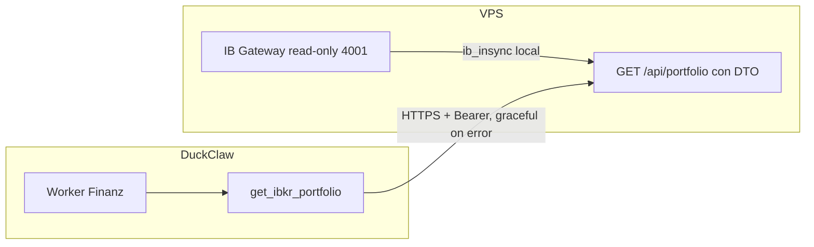

# Plan: Acceso seguro al portfolio IBKR para Finanz (v2)

## Objetivo
El worker **finanz** podrá consultar el estado del portfolio IBKR (posiciones) de forma **solo lectura**, con **data masking** en el Gateway, **graceful degradation** ante fallos de API y validación en el system prompt.

---

## 1. Ajuste de seguridad: Data Masking en el Gateway

Aunque la API en el VPS sea read-only, el JSON crudo de ib_insync es muy verboso y puede incluir números de cuenta completos, IDs de sesión y datos de configuración.

**Recomendación (VPS – Capadonna-Driller):**
- No devolver el JSON crudo de ib_insync.
- Crear un **DTO (Data Transfer Object)** que solo exponga:
  - `symbol`
  - `position`
  - `market_value`
  - `average_cost`
- Beneficios: menos tokens para el LLM, menos riesgo de filtrar datos sensibles en logs (p. ej. LangSmith) y respuestas más claras para el agente.

---

## 2. Ajuste de resiliencia: Graceful Degradation

**Spec:** Si la herramienta está registrada pero la API devuelve error (503, 401, timeout, etc.), el agente debe poder responder de forma útil, por ejemplo:
*"No puedo acceder a tu portfolio en este momento, pero puedo ayudarte con tus gastos registrados en DuckDB."*

**Implementación (DuckClaw – skill):**
- En `get_ibkr_portfolio`: capturar todas las excepciones de la llamada HTTP (incl. `httpx`/`requests` y timeouts).
- En lugar de propagar la excepción (y hacer fallar el grafo), devolver siempre un **string**:
  - Si `response.status_code == 200`: devolver el cuerpo (JSON del DTO).
  - Si no (401, 503, timeout, conexión rechazada, etc.): devolver un mensaje fijo y amigable, p. ej.  
    `"No puedo acceder al portfolio IBKR en este momento (servicio no disponible o error de autenticación). Puedo ayudarte con tus gastos e ingresos registrados en la base de datos."`
- Así el nodo de tools no falla y el LLM puede seguir la conversación con los datos que sí tiene (DuckDB).

---

## 3. Validación en el system prompt

Añadir en [templates/workers/finanz/system_prompt.md](templates/workers/finanz/system_prompt.md) esta instrucción de seguridad:

- *"Si la herramienta get_ibkr_portfolio devuelve un error, no intentes adivinar el estado de tus inversiones. Informa al usuario del error y mantén la conversación enfocada en los datos que sí tienes disponibles."*

---

## 4. Arquitectura (resumen)

---

## 5. Checklist de implementación (orden de ejecución)

### 5.1 VPS (Capadonna-Driller)
- [ ] Implementar endpoint **GET /api/portfolio**.
- [ ] Conectar a IB Gateway (127.0.0.1:4001) con ib_insync en modo read-only.
- [ ] Mapear posiciones a un **DTO** con solo: `symbol`, `position`, `market_value`, `average_cost`.
- [ ] Devolver JSON con ese DTO (array de posiciones).
- [ ] Proteger con **Bearer token** (variable de entorno); rechazar 401 si no coincide.
- [ ] No exponer cuentas completas, IDs de sesión ni configuración interna.

### 5.2 DuckClaw – Skill
- [ ] Crear [templates/workers/finanz/skills/get_ibkr_portfolio.py](templates/workers/finanz/skills/get_ibkr_portfolio.py).
- [ ] Variables de entorno: `IBKR_PORTFOLIO_API_URL`, `IBKR_PORTFOLIO_API_KEY`.
- [ ] Si faltan URL o KEY: devolver lista vacía (no registrar la herramienta).
- [ ] Si están configuradas: registrar herramienta que hace GET con `Authorization: Bearer <key>`, timeout ~10 s.
- [ ] **Graceful degradation:** capturar excepciones y respuestas no 200; devolver siempre un string amigable (sin re-lanzar).
- [ ] **Dependencia:** usar **httpx** si ya está en el proyecto (mejor para async y consistencia con FastAPI); si no, `urllib.request` o añadir `httpx` como dependencia ligera para este skill.

### 5.3 DuckClaw – Manifest
- [ ] En [templates/workers/finanz/manifest.yaml](templates/workers/finanz/manifest.yaml), añadir `get_ibkr_portfolio` a la lista `skills`.

### 5.4 DuckClaw – Prompt
- [ ] En [templates/workers/finanz/system_prompt.md](templates/workers/finanz/system_prompt.md):
  - Indicar que para preguntas sobre portfolio IBKR / posiciones / estado de inversiones use `get_ibkr_portfolio`.
  - Añadir la instrucción de seguridad: si la herramienta devuelve error, no adivinar; informar al usuario y centrarse en los datos disponibles.

### 5.5 Test de integración
- [ ] En el VPS, crear un mock que responda GET /api/portfolio con un JSON estático (ej. 2–3 posiciones con symbol, position, market_value, average_cost).
- [ ] Configurar en DuckClaw `IBKR_PORTFOLIO_API_URL` e `IBKR_PORTFOLIO_API_KEY` apuntando al mock.
- [ ] Verificar que el agente Finanz invoca `get_ibkr_portfolio` y presenta los datos correctamente.
- [ ] Probar con API caída o 401: verificar que el agente responde con el mensaje de degradación y sigue ayudando con DuckDB.

---

## 6. Resumen de seguridad

| Aspecto | Medida |
|--------|--------|
| Solo lectura | API y Gateway en modo read-only; herramienta solo GET. |
| Data masking | DTO en el VPS con solo symbol, position, market_value, average_cost. |
| Credenciales IB | Solo en el VPS; DuckClaw no las ve. |
| Acceso API | Bearer token; sin token, 401. |
| Sin config | Si no hay URL/KEY, la herramienta no se registra. |
| Errores API | Mensaje fijo y amigable; no se propaga excepción al grafo. |
| Prompt | Instrucción de no adivinar si hay error; mantener foco en datos disponibles. |
