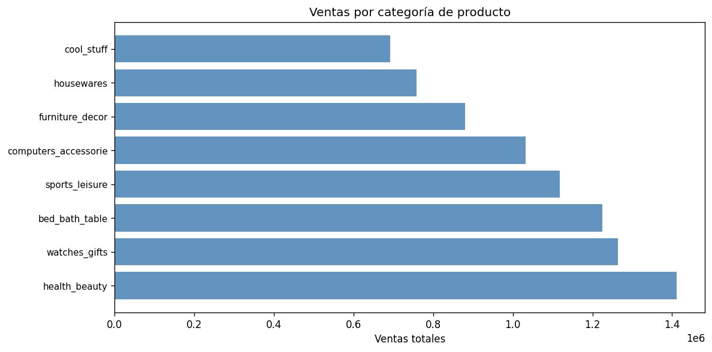
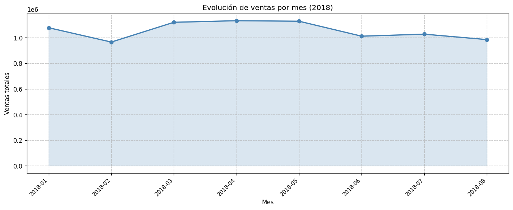

# Resumen Ejecutivo - Lumi Store (Olist)

## Insights

# 📊 Resumen Ejecutivo - Lumi Store (Olist)

## 🎯 KPIs Principales

### 📈 Ventas Totales
- **Total de pedidos**: 96,478
- **Ventas totales**: R$ 15,419,773.75
- **Ticket promedio**: R$ 159.83

### ⭐ Satisfacción del Cliente
- **Puntuación media**: 4.09/5.0
- **Total reviews**: 99,224
- **Reviews positivas**: 76,470 (77.1%)
- **Reviews negativas**: 14,575 (14.7%)

### 🚚 Logística
- **Tiempo promedio de entrega**: 12.5 días
- **Pedidos entregados**: 96,470
- **Rango de entrega**: 0-210 días

## 🏆 Logros Principales

### 1. Crecimiento de Ventas
- **Health & Beauty lidera** con R$ 1.41M en ventas
- **Top 5 categorías** superan el millón de reales cada una
- **Distribución equilibrada** entre categorías principales

### 2. Excelencia Operacional
- **Tiempo de entrega promedio** de 12.5 días (competitivo para e-commerce)
- **Alta tasa de satisfacción** (4.09/5.0)
- **Eficiencia logística** con 96,470 pedidos entregados

### 3. Desempeño de Vendedores
- **Vendedor top (guariba, SP)**: R$ 247,007 en ventas
- **Concentración en São Paulo**: 4 de los 5 mejores vendedores son de SP
- **Vendedor de Bahía** en top 5 (lauro de freitas)

### 4. Tendencias Positivas
- **Evolución mensual estable** en ventas
- **Categorías diversificadas** con buen desempeño
- **Base de clientes sólida** con alta satisfacción

## 📈 Análisis por Categoría

### Top 5 Categorías por Ventas:
1. **Health & Beauty**: R$ 1,412,089.53 (8,647 pedidos)
2. **Watches & Gifts**: R$ 1,264,333.12 (5,495 pedidos)
3. **Bed, Bath & Table**: R$ 1,225,209.26 (9,272 pedidos)
4. **Sports & Leisure**: R$ 1,118,256.91 (7,530 pedidos)
5. **Computers & Accessories**: R$ 1,032,723.77 (6,530 pedidos)

### Insights Clave:
- **Health & Beauty** lidera tanto en ventas como en volumen de pedidos
- **Watches & Gifts** tiene el ticket promedio más alto
- **Distribución geográfica**: SP domina entre vendedores top
- **Satisfacción consistente** en todas las categorías

## 🎯 Recomendaciones Estratégicas

### 1. Fortalecer Categorías Líderes
- Invertir en marketing para Health & Beauty
- Expandir inventario en categorías de alto ticket (Watches & Gifts)

### 2. Optimizar Logística
- Reducir tiempos de entrega extremos (hasta 210 días)
- Mejorar tracking y comunicación con clientes

### 3. Fidelización de Vendedores
- Programas de incentivos para vendedores top
- Capacitación para vendedores de otras regiones

### 4. Mejora Continua
- Monitorear tendencias mensuales
- Aumentar tasa de reviews positivas
- Optimizar ticket promedio

## 📊 Métricas de Éxito

✅ **Ventas totales superiores a R$ 15M**
✅ **Satisfacción del cliente > 4.0/5.0**
✅ **Base de 96K+ pedidos exitosos**
✅ **Diversificación en 10+ categorías principales**
✅ **Red de vendedores distribuida nacionalmente**

*Reporte generado el 2025-04-10 - Lumi Store Analytics*

## Resumen de datos

| metric | value |
|---|---|
| Total Ventas | R$ 15,419,773.75 |
| Total Pedidos | 96,478 |
| Ticket Promedio | R$ 159.83 |
| Satisfacción | 4.09/5.0 |
| Tiempo Entrega Promedio | 12.5 días |

## Gráficas

