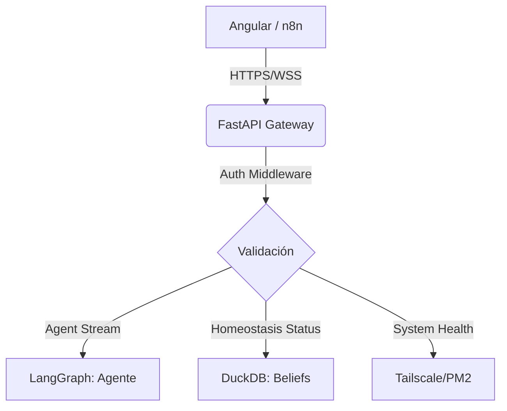

# API Gateway (FastAPI) para DuckClaw

## 1. Objetivo Arquitectónico
Implementar un **API Gateway** robusto en `FastAPI` que sirva como único punto de entrada para el frontend (Angular) y la comunicación entre servicios (n8n, Mac Mini, VPS). Este gateway debe gestionar la autenticación, el enrutamiento de peticiones hacia los agentes (LangGraph) y la exposición de métricas de homeostasis, garantizando el cumplimiento de **Habeas Data** mediante validación de tokens y auditoría de logs.

## 2. Topología del API Gateway



## 3. Especificación de Endpoints (Contrato API)

### A. Módulo de Agentes (Streaming)
*   **`POST /api/v1/agent/{worker_id}/chat`**: Envía un mensaje al agente.
    *   *Body:* `message`, `session_id`, `history` (opcional), **`stream`** (default: true).
    *   *Response (stream=true):* `StreamingResponse` (SSE) token por token.
    *   *Response (stream=false):* JSON `{"response": "...", "session_id": "..."}` — **requerido para n8n/webhooks**.
*   **`GET /api/v1/agent/{worker_id}/history`**: Recupera el historial de chat (truncado a K=6).

### B. Módulo de Homeostasis (Dashboard)
*   **`GET /api/v1/homeostasis/status`**: Retorna el estado de salud de todos los workers activos.
    *   *Response:* `{"worker_id": "finanz", "status": "green", "beliefs": [...]}`.
*   **`POST /api/v1/homeostasis/{worker_id}/action`**: Ejecuta una acción de restauración manualmente (HITL).

### C. Módulo de Sistema (Observabilidad)
*   **`GET /api/v1/system/health`**: Verifica conectividad con Tailscale, DuckDB y MLX.
*   **`GET /api/v1/system/logs`**: Stream de logs de los agentes (vía `pm2` API).

## 4. Especificación de Middleware de Seguridad

*   **`AuthMiddleware`**:
    *   Valida `X-Tailscale-Auth-Key` para peticiones internas (n8n).
    *   Valida `Authorization: Bearer <JWT>` para peticiones externas (Angular).
*   **`AuditMiddleware`**:
    *   Registra cada petición en `LangSmith` con: `user_id`, `worker_id`, `endpoint`, `timestamp`.
    *   **Habeas Data:** Anonimiza automáticamente cualquier campo `message` o `payload` que contenga patrones de tarjetas de crédito o emails antes de persistir el log.

## 5. Implementación del Gateway (Estructura)

```python
# duckclaw/api/gateway.py
from fastapi import FastAPI, Depends, Security
from fastapi.middleware.cors import CORSMiddleware

app = FastAPI(title="DuckClaw API Gateway")

# CORS para Angular
app.add_middleware(
    CORSMiddleware,
    allow_origins=["https://finanz.tudominio.com"],
    allow_methods=["*"],
    allow_headers=["*"],
)

# Middleware de Autenticación
async def verify_token(token: str = Security(api_key_header)):
    # Lógica de validación contra Tailscale o JWT
    pass

@app.post("/api/v1/agent/{worker_id}/chat")
async def chat_with_agent(worker_id: str, payload: ChatRequest, auth=Depends(verify_token)):
    # 1. Instanciar/Recuperar agente desde el Forge
    # 2. Invocar LangGraph
    # 3. Retornar StreamingResponse
    pass
```

## 6. Integración con el Frontend (Angular)
El desarrollador de Angular debe implementar un servicio `AgentService` que:
1.  Abra una conexión `EventSource` (SSE) hacia `/api/v1/agent/{worker_id}/chat`.
2.  Maneje la reconexión automática si el túnel de Tailscale parpadea.
3.  Renderice el "Semáforo de Salud" consultando `/api/v1/homeostasis/status` cada 30 segundos.

## 7. Consideraciones de Seguridad (Habeas Data)
*   **Rate Limiting:** Implementar `slowapi` para prevenir ataques de fuerza bruta contra el agente.
*   **Data Masking:** El gateway debe tener un filtro de salida que impida que el agente envíe datos sensibles (ej. números de cuenta completos) al frontend si el usuario no tiene permisos de administrador.
*   **Zero-Trust:** El API Gateway no debe confiar en el frontend. Toda validación de permisos (¿puede este usuario ejecutar esta acción?) debe ocurrir en el nodo `HomeostasisManager` o `SQLValidator` dentro del grafo, no en el API Gateway.