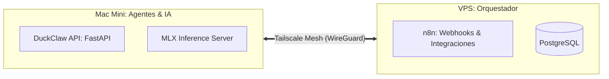

# Arquitectura de Red Distribuida (Tailscale Mesh)

## 1. Objetivo Arquitectónico
Establecer una **Tailnet (Mesh VPN)** privada entre la Mac Mini (M4) y el VPS (Ubuntu) para habilitar la comunicación bidireccional segura, eliminando la necesidad de exponer puertos públicos o gestionar certificados SSL complejos para el tráfico interno. Esta arquitectura garantiza el cumplimiento de **Habeas Data** al cifrar el tráfico de extremo a extremo (E2EE) fuera del alcance de proveedores de red.

## 2. Topología de Red (Tailscale Mesh)



## 3. Especificación de Configuración (Zero-Trust)

### A. Nodos de la Tailnet
*   **Nodo A (Mac Mini):** Ejecuta `tailscaled`. IP asignada: `100.x.y.z`.
*   **Nodo B (VPS):** Ejecuta `tailscaled`. IP asignada: `100.a.b.c`.

### B. Reglas de Acceso (Tailscale ACLs)
Para garantizar la seguridad, se deben configurar las ACLs en el panel de control de Tailscale para implementar el principio de **Privilegio Mínimo**:

```json
{
  "acls": [
    // Permitir que el VPS (n8n) acceda a la API de DuckClaw en la Mac Mini
    {
      "action": "accept",
      "src": ["tag:vps"],
      "dst": ["tag:mac-mini:8000"] 
    },
    // Bloquear todo lo demás por defecto
  ]
}
```

## 4. Especificación de Skill: `TailscaleBridge`

Este nodo gestiona la conectividad y el descubrimiento de servicios dentro de la red privada.

*   **Entrada:** `service_name` (ej. `n8n-api`), `target_ip` (IP de Tailscale).
*   **Lógica:**
    1.  **Health Check:** Verificar que el túnel esté activo (`tailscale status`).
    2.  **Service Discovery:** Resolver la IP privada del servicio destino.
    3.  **Proxy de Seguridad:** Inyectar cabeceras de autenticación (mTLS o JWT) en cada petición que cruza la Tailnet.
*   **Salida:** `ConnectionStatus` (Active/Down).

## 5. Protocolo de Comunicación (API-First)

La comunicación entre n8n (VPS) y DuckClaw (Mac Mini) debe seguir este contrato:

1.  **Endpoint de n8n (VPS):** `http://100.a.b.c:5678/webhook/...`
2.  **Endpoint de DuckClaw (Mac Mini):** `http://100.x.y.z:8000/api/v1/...`
3.  **Autenticación:**
    *   Ambos servicios deben validar un `X-Tailscale-Auth-Key` o un `JWT` firmado internamente.
    *   **Habeas Data:** El tráfico no sale a la internet pública; permanece dentro del túnel cifrado de WireGuard.

## 6. Ventajas de Cumplimiento y Operación

1.  **Soberanía de Datos:** Los datos financieros que viajan entre la Mac Mini y el VPS nunca tocan la internet pública.
2.  **Resiliencia:** Si el VPS pierde conexión a internet, la red local de la Mac Mini sigue funcionando. Si la Mac Mini se desconecta, n8n puede encolar las tareas en PostgreSQL y reintentar automáticamente cuando el túnel se restablezca.
3.  **Auditoría:** Tailscale proporciona logs de conexión (quién se conectó a qué), lo cual es un requisito de auditoría forense para sistemas que manejan información financiera.

## 7. Roadmap de Despliegue

1.  **Instalación:** Ejecutar `curl -fsSL https://tailscale.com/install.sh | sh` en ambos nodos.
2.  **Autenticación:** `tailscale up` en ambos dispositivos.
3.  **Configuración de Firewall:**
    *   En la Mac Mini: `ufw allow in on tailscale0` (permitir tráfico solo desde la interfaz de Tailscale).
    *   En el VPS: `ufw allow in on tailscale0`.
4.  **Verificación:** Probar `curl http://100.x.y.z:8000/health` desde el VPS para confirmar la conectividad.