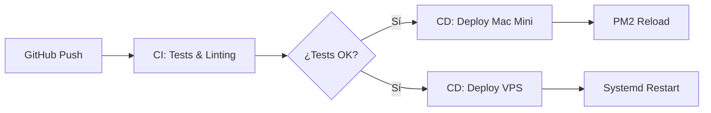

# Pipeline de Despliegue Continuo (CI/CD) para Arquitectura Distribuida

## 1. Objetivo Arquitectónico
Implementar un pipeline de **Despliegue Continuo (CI/CD)** que automatice la sincronización de código entre el repositorio central (GitHub) y los dos nodos de la arquitectura: **Mac Mini (Agente)** y **VPS (Orquestador)**. El pipeline debe garantizar la integridad del entorno, la ejecución de tests de integración y el despliegue sin tiempo de inactividad (*Zero-Downtime Deployment*).

## 2. Topología del Pipeline (GitHub Actions)



## 3. Especificación de Skills del Pipeline

### A. CI: Validación de Integridad
*   **Lógica:**
    1.  Ejecutar `pytest` sobre el directorio `tests/` (incluyendo `test_tailscale_bridge.py`).
    2.  Ejecutar `mypy` para validación de tipos estáticos.
    3.  Ejecutar `sqlglot` para validar que los cambios en el código no rompan las consultas SQL del `SQLValidator`.

### B. CD: Despliegue en Mac Mini (Agente)
*   **Tecnología:** `GitHub Actions Self-Hosted Runner` (instalado en la Mac Mini).
*   **Lógica:**
    1.  `git pull origin main`.
    2.  `uv sync` (actualizar dependencias).
    3.  `pm2 reload ecosystem.config.cjs` (recarga en caliente de los agentes).
    4.  **Validación:** Ejecutar un `health_check` contra la API local antes de marcar el despliegue como exitoso.

### C. CD: Despliegue en VPS (Orquestador)
*   **Tecnología:** `SSH + rsync` (vía GitHub Actions).
*   **Lógica:**
    1.  Sincronizar archivos de configuración de n8n y scripts de soporte.
    2.  `docker compose pull && docker compose up -d` (actualización de servicios).
    3.  `systemctl restart n8n` (si hubo cambios en la configuración del servicio).

## 4. Contrato de Despliegue (GitHub Actions Workflow)

```yaml
# .github/workflows/deploy.yml
name: DuckClaw CI/CD

on:
  push:
    branches: [ main ]

jobs:
  test:
    runs-on: ubuntu-latest
    steps:
      - uses: actions/checkout@v4
      - name: Run Tests
        run: pytest tests/

  deploy-mac:
    needs: test
    runs-on: [self-hosted, mac-mini]
    steps:
      - run: |
          git pull origin main
          uv sync
          pm2 reload ecosystem.config.cjs

  deploy-vps:
    needs: test
    runs-on: ubuntu-latest
    steps:
      - name: Deploy to VPS
        uses: appleboy/ssh-action@master
        with:
          host: ${{ secrets.VPS_IP }}
          script: |
            cd /opt/duckclaw-vps
            git pull origin main
            docker compose up -d
```

## 5. Protocolo de Seguridad (Habeas Data & Secretos)
*   **Secretos:** Nunca incluir tokens en el repo. Usar `GitHub Secrets` para `VPS_SSH_KEY`, `TAILSCALE_AUTH_KEY`, y `GITHUB_TOKEN`.
*   **Runner Privado:** El uso de un *Self-Hosted Runner* en la Mac Mini es crítico. Esto permite que el despliegue ocurra dentro de tu red privada (Tailnet), sin exponer el puerto SSH de la Mac Mini a internet.
*   **Rollback Automático:** Si el `health_check` post-despliegue falla, el pipeline debe ejecutar automáticamente `git checkout HEAD~1` y `pm2 reload` para restaurar la versión anterior.

## 6. Observabilidad del Despliegue
*   **Notificación:** El pipeline debe enviar un mensaje a un canal de Telegram (usando el bot de `duckclaw`) notificando: "Despliegue exitoso en Mac Mini y VPS. Versión: [commit_hash]".
*   **Trazabilidad:** Cada despliegue debe registrarse en `LangSmith` como un evento de sistema, permitiendo correlacionar errores de agentes con versiones específicas del código.