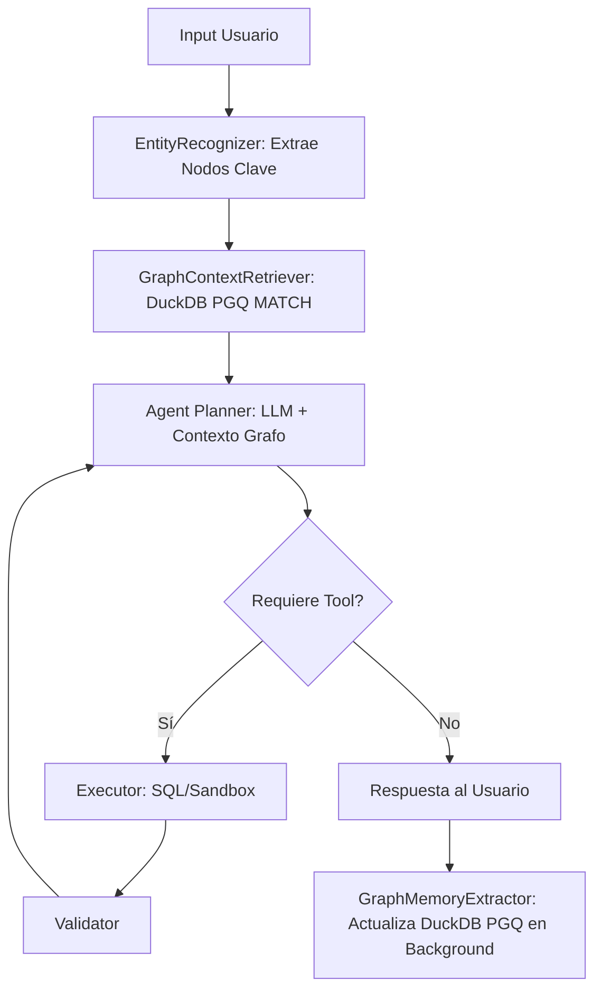

# Memoria Estructural Basada en Grafos (DuckDB PGQ / GraphRAG)

## 1. Veredicto Arquitectónico
La implementación de **DuckDB Property Graph Queries (SQL/PGQ)** es la evolución arquitectónica definitiva para `duckclaw`. Elimina la necesidad de bases de datos vectoriales externas o motores de grafos pesados (como Neo4j), permitiendo implementar **GraphRAG (Graph Retrieval-Augmented Generation)** de forma 100% local, soberana y con latencia de microsegundos.

Esta arquitectura transforma el historial plano en una **Memoria Semántica Multi-Salto (Multi-hop)**, ideal para razonamiento financiero complejo (ej. *Usuario -> COMPRÓ_EN -> Starbucks -> CATEGORÍA -> Café*).

## 2. Diseño del Esquema Relacional-Grafo (DDL)
DuckDB PGQ construye el grafo dinámicamente sobre tablas relacionales estándar.

### A. Tablas Base (Nodos y Aristas)
```sql
-- Nodos (Entidades extraídas por el LLM)
CREATE TABLE memory_nodes (
    node_id VARCHAR PRIMARY KEY,
    label VARCHAR, -- Ej: 'USER', 'MERCHANT', 'CATEGORY', 'PREFERENCE'
    properties JSON
);

-- Aristas (Relaciones entre entidades)
CREATE TABLE memory_edges (
    edge_id VARCHAR PRIMARY KEY,
    source_id VARCHAR,
    target_id VARCHAR,
    relationship VARCHAR, -- Ej: 'SPENDS_ON', 'PREFERS', 'LOCATED_IN'
    weight DOUBLE DEFAULT 1.0,
    FOREIGN KEY (source_id) REFERENCES memory_nodes(node_id),
    FOREIGN KEY (target_id) REFERENCES memory_nodes(node_id)
);
```

### B. Declaración del Grafo de Propiedades (PGQ)
```sql
INSTALL pgq;
LOAD pgq;

CREATE OR REPLACE PROPERTY GRAPH duckclaw_kg
VERTEX TABLES (
    memory_nodes LABEL entity
)
EDGE TABLES (
    memory_edges SOURCE KEY (source_id) REFERENCES memory_nodes (node_id)
                 DESTINATION KEY (target_id) REFERENCES memory_nodes (node_id)
                 LABEL relation
);
```

## 3. Especificación de Skills (Mutación y Recuperación)

### Skill 1: `GraphMemoryExtractor` (Write Pipeline)
*   **Ubicación en LangGraph:** Nodo asíncrono post-respuesta (Background Task) para no penalizar el *Time-To-First-Token* del usuario.
*   **Entrada:** Última interacción `(HumanMessage, AIMessage)`.
*   **Lógica:**
    1.  Inyectar el diálogo en un LLM local (Llama-3.2-3B) con un prompt de extracción de tripletas: `(Sujeto, Predicado, Objeto)`.
    2.  Validar que las tripletas cumplan con la ontología financiera permitida.
    3.  Ejecutar `INSERT ON CONFLICT DO UPDATE` en `memory_nodes` y `memory_edges`.
*   **Salida:** Grafo de conocimiento actualizado silenciosamente.

### Skill 2: `GraphContextRetriever` (Read Pipeline)
*   **Ubicación en LangGraph:** Nodo `prepare` o `retrieve` (antes del LLM).
*   **Entrada:** Entidades detectadas en el prompt actual del usuario (ej. "Starbucks", "Presupuesto").
*   **Lógica:**
    1.  Ejecutar una consulta de emparejamiento de patrones (Pattern Matching) usando la sintaxis `GRAPH_TABLE` de DuckDB.
    2.  **Ejemplo de Query PGQ:**
        ```sql
        SELECT source_name, relation, target_name 
        FROM GRAPH_TABLE (duckclaw_kg
            MATCH (s:entity)-[r:relation]->(t:entity)
            WHERE s.properties->>'name' = 'Juan' AND r.relationship = 'PREFERS'
            COLUMNS (s.properties->>'name' AS source_name, r.relationship AS relation, t.properties->>'name' AS target_name)
        );
        ```
    3.  Formatear los resultados como un bloque de contexto estructurado.
*   **Salida:** Cadena de texto inyectada en el `<contexto_historico>` del System Prompt.

## 4. Integración en el Grafo de Estado (LangGraph)

El flujo cíclico se reestructura para soportar la memoria estructural:



## 5. Ventajas de Cumplimiento (Habeas Data)
1.  **Derecho al Olvido Granular:** Si un usuario solicita eliminar un dato específico (ej. "Olvida que compro en Starbucks"), basta con ejecutar un `DELETE FROM memory_nodes WHERE node_id = 'Starbucks'`. Las restricciones de clave foránea (o un borrado en cascada) eliminan las aristas automáticamente. Esto es matemáticamente imposible en bases de datos vectoriales (Embeddings) sin re-indexar todo el dataset.
2.  **Auditoría Estructural:** El grafo permite visualizar exactamente qué "cree" el agente sobre el usuario, exportando las tablas a herramientas como Gephi o renderizándolas en el frontend (Angular) mediante D3.js.