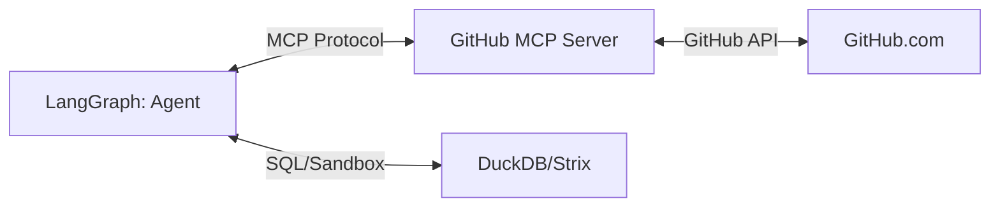

# Integración de GitHub MCP en DuckClaw

## 1. Objetivo Arquitectónico
Convertir a `duckclaw` en un **Agente de Ingeniería Autónoma**. Al conectar el `github-mcp-server`, tu agente no solo gestiona finanzas, sino que puede:
*   Leer el código fuente de `duckclaw` para auto-depurarse.
*   Crear *Issues* cuando el `GRPO_Evaluator` detecta fallos recurrentes.
*   Hacer *Pull Requests* con las mejoras de código sugeridas por el modelo.

## 2. Topología de Integración (MCP Bridge)



## 3. Especificación de Skill: `GitHubEngineeringSkill`

*   **Entrada:** `github_token` (almacenado en `.env`), `repo_name`.
*   **Lógica:**
    1.  **Instanciación:** El `forge` levanta el servidor MCP de GitHub como un proceso hijo o un cliente conectado vía `stdio`.
    2.  **Exposición:** Las herramientas de GitHub (ej. `read_file`, `create_issue`, `search_code`) se registran en el `SkillRegistry` de `duckclaw`.
    3.  **Seguridad (Habeas Data):** El agente solo tiene acceso a repositorios específicos definidos en el `manifest.yaml` del trabajador.
*   **Salida:** Resultados de la API de GitHub formateados para el LLM.

## 4. Implementación en el `forge`

Para que esto sea *Plug & Play*, el `forge` debe gestionar la conexión:

```python
# duckclaw/forge/skills/github_bridge.py
from mcp import ClientSession, StdioServerParameters

async def connect_github_mcp():
    server_params = StdioServerParameters(
        command="npx",
        args=["-y", "@modelcontextprotocol/server-github"],
        env={"GITHUB_PERSONAL_ACCESS_TOKEN": os.environ["GITHUB_TOKEN"]}
    )
    async with ClientSession(server_params) as session:
        # Ahora el agente puede llamar a session.call_tool("github_search_code", ...)
        pass
```

## 5. Casos de Uso para `duckclaw`

1.  **Auto-Depuración (Self-Healing):**
    *   Si el `StrixSandbox` reporta un error de sintaxis en un script, el agente usa `github_read_file` para leer el código, lo analiza, y usa `github_create_issue` para documentar el bug.
2.  **Documentación Dinámica:**
    *   El agente puede actualizar el `README.md` o los archivos `SKILL.md` automáticamente cuando añades una nueva funcionalidad.
3.  **Pipeline de Mejora (GRPO):**
    *   Cuando el `GRPO_Trainer` genera una mejora en el modelo, el agente puede crear un *Pull Request* en tu repo con los nuevos pesos o scripts de entrenamiento.

## 6. Consideraciones de Seguridad (Zero-Trust)
*   **Scope del Token:** El `GITHUB_PERSONAL_ACCESS_TOKEN` debe tener permisos **exclusivamente** sobre el repositorio `duckclaw`. Nunca uses un token con acceso a toda tu cuenta.
*   **Human-in-the-Loop (HITL):** Para acciones destructivas (ej. `github_delete_branch` o `github_merge_pr`), el `SQLValidator` debe ser extendido a un `ActionValidator` que requiera el comando `/approve` del usuario en Telegram antes de ejecutar la llamada MCP.

## 7. ¿Por qué esto es superior a otras integraciones?
*   **Estandarización:** Al usar el servidor oficial de GitHub MCP, no tienes que mantener código de integración. Si GitHub actualiza su API, solo actualizas el paquete `npx`.
*   **Interoperabilidad:** Si mañana decides usar otro agente (ej. Claude Desktop), puedes conectar el mismo servidor MCP de GitHub y compartir las herramientas.