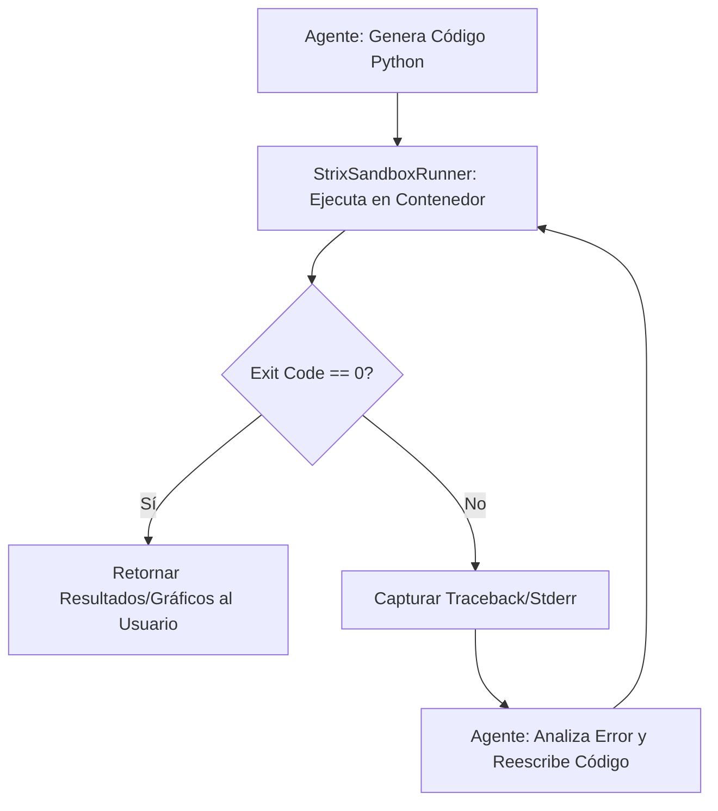

# Sandbox de Ejecución Libre Basado en Strix

## 1. Objetivo Arquitectónico
Proveer al agente (LLM) de un entorno de ejecución *Turing-completo* donde tenga libertad absoluta para escribir, ejecutar y depurar código (Python, Bash, SQL) sin comprometer la seguridad del host (VPS) ni la integridad de la base de datos maestra. Se utilizará la arquitectura de contenedores de **Strix** para garantizar un aislamiento robusto (Zero-Trust) y persistencia de sesión.

## 2. Topología del Entorno (Strix Sandbox)
En lugar de restringir al LLM mediante listas blancas de AST, le otorgamos un "patio de juegos" destructible.

*   **Imagen Base:** `ghcr.io/usestrix/strix-sandbox` (o un `Dockerfile` derivado con dependencias analíticas como `pandas`, `matplotlib`, `duckdb`).
*   **Aislamiento (Docker):**
    *   `Network`: Aislada (sin acceso a la red interna del VPS, acceso a internet restringido o nulo según el caso de uso).
    *   `Privileges`: Drop de todas las *capabilities* de Linux (`--cap-drop=ALL`).
    *   `Resources`: Límites estrictos vía cgroups (ej. `cpus=1`, `memory=512m`).
*   **Persistencia de Sesión:** Strix mantiene una terminal Bash interactiva abierta durante el ciclo de vida del `thread_id` de LangGraph, permitiendo al agente ejecutar comandos secuenciales, instalar librerías al vuelo y mantener variables en memoria.

## 3. Protocolo de Firewall de Datos (Habeas Data)
El sandbox **nunca** debe tener acceso al archivo `duckclaw.db` de producción.

### Flujo de Inyección Segura:
1.  **Petición:** El agente decide que necesita analizar datos complejos (ej. "Generar un modelo de predicción de gastos").
2.  **Extracción (Host):** Un nodo seguro en LangGraph ejecuta un `SELECT` pre-aprobado y exporta el resultado a un archivo `/tmp/session_id/data.parquet`.
3.  **Montaje (Sandbox):** El contenedor Strix se levanta montando ese directorio en modo **Solo Lectura** (`-v /tmp/session_id:/workspace/data:ro`).
4.  **Ejecución:** El agente lee el `.parquet`, ejecuta su código libremente y escribe los resultados (ej. un gráfico `.png` o un `.json`) en un directorio de salida montado (`/workspace/output`).

## 4. Especificación de Skill: `StrixSandboxRunner`

Este nodo reemplaza al ejecutor estándar en LangGraph cuando se requiere código dinámico.

*   **Entrada:** `script_content` (string), `language` (python/bash), `session_id`.
*   **Lógica Interna:**
    1.  **Provisioning:** Verificar si existe un contenedor Strix activo para el `session_id`. Si no, instanciar uno nuevo usando el SDK de Docker.
    2.  **Execution:** Enviar el `script_content` a la terminal interactiva del contenedor Strix.
    3.  **Monitoring:** Capturar el flujo de salida (`stdout` / `stderr`) con un *timeout* estricto (ej. 30 segundos).
    4.  **Artifact Retrieval:** Si el agente generó archivos en `/workspace/output`, moverlos al host y generar URLs temporales o codificarlos en Base64 para enviarlos por Telegram.
*   **Salida:** `ExecutionResult` (código de salida, logs de consola, rutas de artefactos).

## 5. Bucle de Auto-Corrección (Agentic Loop)
Al darle libertad al LLM, el código fallará frecuentemente. El grafo debe manejar esto de forma autónoma.



## 6. Contrato de Implementación (Python Docker SDK)

El puente entre LangGraph y Strix debe implementarse gestionando el ciclo de vida del contenedor:

```python
import docker
from pydantic import BaseModel

class StrixSandboxManager:
    def __init__(self):
        self.client = docker.from_env()
        self.image = "ghcr.io/usestrix/strix-sandbox:latest"

    def run_agent_code(self, code: str, session_id: str, data_path: str) -> dict:
        """
        Ejecuta código arbitrario del LLM en el entorno aislado de Strix.
        """
        container_name = f"strix_sandbox_{session_id}"
        
        # 1. Levantar contenedor con montajes seguros
        container = self.client.containers.run(
            self.image,
            command="tail -f /dev/null", # Mantener vivo
            name=container_name,
            detach=True,
            mem_limit="512m",
            network_mode="none", # Zero exfiltration
            volumes={
                data_path: {'bind': '/workspace/data', 'mode': 'ro'},
                f"/tmp/output_{session_id}": {'bind': '/workspace/output', 'mode': 'rw'}
            }
        )
        
        try:
            # 2. Ejecutar el código del LLM
            # (En producción, usar la API de terminal interactiva de Strix)
            exec_result = container.exec_run(cmd=["python3", "-c", code])
            
            return {
                "exit_code": exec_result.exit_code,
                "output": exec_result.output.decode("utf-8")
            }
        finally:
            # 3. Teardown (Limpieza obligatoria)
            container.stop()
            container.remove()
```

## 7. Trazabilidad Forense (LangSmith)
Dado que el código es libre, la auditoría es crítica.
*   **Log de Intención:** El prompt original del usuario.
*   **Log de Ejecución:** El código exacto generado por el LLM inyectado en Strix.
*   **Log de Resultado:** El `stdout`/`stderr` devuelto por el contenedor.
*   **Regla de Cumplimiento:** Todo este bloque debe registrarse en LangSmith bajo la etiqueta `execution_environment: strix_sandbox`, permitiendo auditar qué intentó hacer el agente en el entorno aislado.