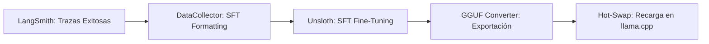

# Pipeline de Entrenamiento Autónomo (SFT + Unsloth)

## 1. Objetivo Arquitectónico
Migrar el pipeline de entrenamiento de **GRPO** (Aprendizaje por Refuerzo) a **SFT (Supervised Fine-Tuning)**. El SFT es más estable, predecible y eficiente para tareas de generación de código SQL y Python en entornos de producción. El objetivo es que el modelo aprenda por **imitación directa** de las trazas exitosas almacenadas en LangSmith, garantizando que el agente replique los patrones de razonamiento que ya han sido validados por el `SQLValidator` y el `StrixSandbox`.

## 2. Arquitectura del Pipeline SFT



## 3. Especificación de Skills del Worker de Entrenamiento (SFT)

### Skill: `SFT_DataCollector`
*   **Entrada:** Trazas de LangSmith con `reward == 1.0`.
*   **Lógica:**
    1.  **Formateo ChatML:** Convertir cada traza en un objeto de entrenamiento:
        ```json
        {"messages": [{"role": "system", "content": "..."}, {"role": "user", "content": "..."}, {"role": "assistant", "content": "<code>"}]}
        ```
    2.  **Data Masking:** Aplicar regex para anonimizar cualquier dato sensible (PII) antes de guardar el dataset.
*   **Salida:** `dataset_sft.jsonl` (formato compatible con `trl` / `unsloth`).

### Skill: `SFT_Trainer` (Unsloth)
*   **Entrada:** `dataset_sft.jsonl`, Modelo Base (`Llama-3.2-3B-Instruct`).
*   **Lógica:**
    1.  **Carga:** Cargar modelo en 4-bit (QLoRA) con `Unsloth`.
    2.  **Configuración SFT:**
        *   `SFTTrainer` de la librería `trl`.
        *   `max_seq_length`: 2048 (suficiente para contexto financiero).
        *   `learning_rate`: 2e-4 (estándar para QLoRA).
        *   `packing`: `True` (para optimizar el entrenamiento con múltiples ejemplos por secuencia).
    3.  **Ejecución:** Entrenamiento supervisado directo sobre las trazas exitosas.
*   **Salida:** Adaptador LoRA (Adapter).

### Skill: `ModelConverter`
*   **Entrada:** Adaptador LoRA.
*   **Lógica:**
    1.  `model.save_pretrained_gguf()`: Unsloth permite exportar directamente a GGUF (formato nativo de `llama.cpp`).
    2.  **Validación:** Verificar que el archivo `.gguf` resultante sea legible por el motor de inferencia actual.
*   **Salida:** `model_finetuned.gguf`.

## 4. Configuración del Worker en PM2 (`ecosystem.config.cjs`)

```javascript
{
  name: "DuckClaw-Trainer-SFT",
  script: "scripts/train_sft.py",
  cron: "0 4 * * *", // Ejecución diaria a las 4 AM
  autorestart: false,
  env: {
    "MODEL_NAME": "unsloth/Llama-3.2-3B-Instruct-bnb-4bit",
    "DATASET_PATH": "./data/training/dataset_sft.jsonl",
    "OUTPUT_DIR": "./models/finetuned/"
  }
}
```

## 5. Protocolo de Seguridad y Habeas Data (SFT)
*   **Inmutabilidad del Dataset:** El dataset de entrenamiento se almacena en un volumen cifrado en el VPS.
*   **Validación de Calidad:** Antes de iniciar el SFT, el script debe ejecutar un `dataset_validator.py` que verifique que no existan duplicados y que la sintaxis SQL en el dataset sea correcta (usando `sqlglot`).
*   **Rollback Automático:** Si el modelo resultante tiene una tasa de error (evaluada contra un set de validación) superior al modelo actual, el `ModelHotSwapper` aborta el reemplazo y mantiene la versión anterior.

## 6. Ventajas del SFT sobre GRPO para tu caso
1.  **Estabilidad:** El SFT no sufre de la inestabilidad de los algoritmos de RL (como el colapso de política).
2.  **Eficiencia:** Requiere menos cómputo y menos tiempo de entrenamiento para alcanzar resultados óptimos en tareas de generación de código.
3.  **Previsibilidad:** Al entrenar sobre trazas que ya sabemos que funcionan (reward 1.0), garantizamos que el modelo aprenda el "estilo" de código que nuestro `SQLValidator` y `StrixSandbox` ya han aprobado.