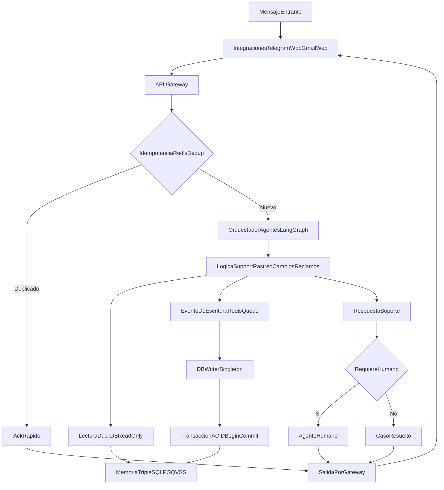

# Diagrama de flujo - Support Assistant (Duckclaw)

```mermaid
flowchart TD
    inbound[MensajeEntrante] --> channels[IntegracionesTelegramWppGmailWeb]
    channels --> gateway[API Gateway]
    gateway --> dedup{IdempotenciaRedisDedup}

    dedup -->|Duplicado| ack[AckRapido]
    dedup -->|Nuevo| orchestrator[OrquestadorAgentesLangGraph]

    orchestrator --> support[LogicaSupportRastreoCambiosReclamos]
    support --> memoryRead[LecturaDuckDBReadOnly]
    memoryRead --> triple[MemoriaTripleSQLPGQVSS]

    support --> writeQueue[EventoDeEscrituraRedisQueue]
    writeQueue --> dbWriter[DBWriterSingleton]
    dbWriter --> tx[TransaccionACIDBeginCommit]
    tx --> triple

    support --> response[RespuestaSoporte]
    response --> escalate{RequiereHumano}
    escalate -->|Si| human[AgenteHumano]
    escalate -->|No| resolved[CasoResuelto]

    human --> outbound[SalidaPorGateway]
    resolved --> outbound
    ack --> outbound
    outbound --> channels
```
